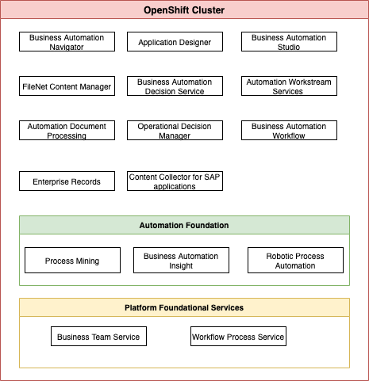
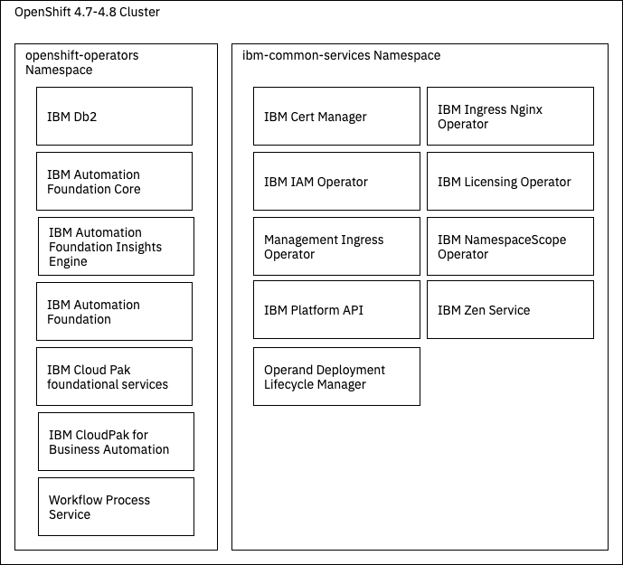
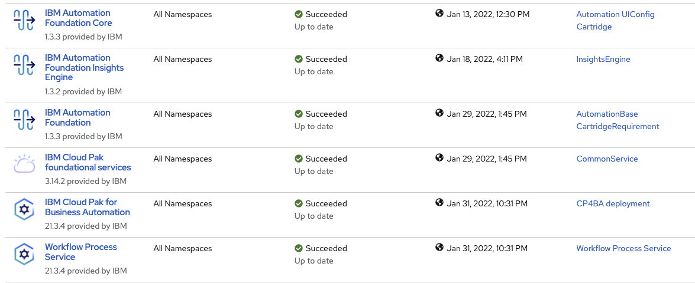
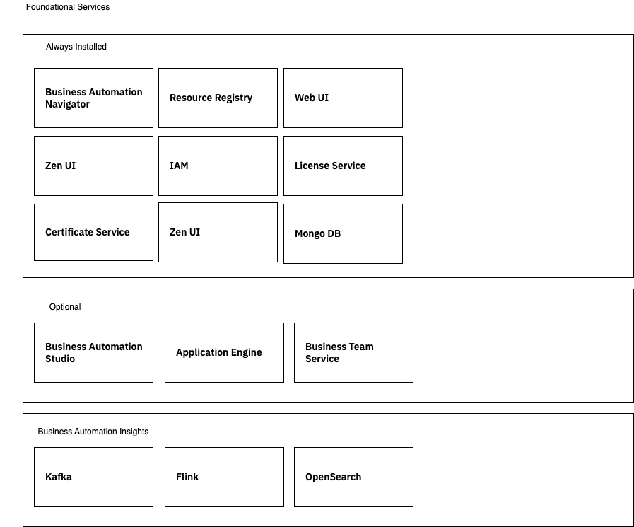
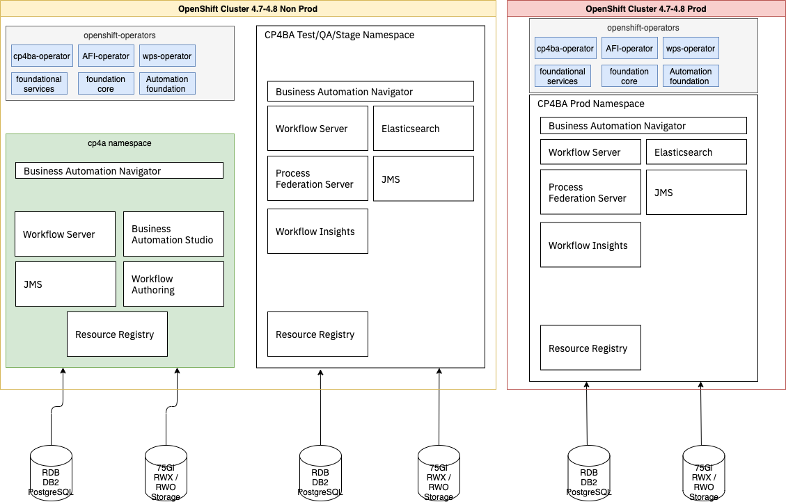

# Digital Business Automation Solution gitOps catalog

Updated 2/2/22

[GitOps](https://www.redhat.com/en/topics/devops/what-is-gitops) is a set of practices to manage infrastructure and application configurations using Git.
GitOps works by using Git as a single source of truth for declarative infrastructure and applications.
GitOps uses Git pull requests to manage infrastructure provisioning and deployment automatically. 
The Git repository contains the entire state of the system so that the trail of changes to the system state is visible and auditable.

## Overview

This GitOps Catalog includes [kustomize](http://kustomize.io) base and overlays folders for a 
number of OpenShift operators needed to deploy IBM Cloud Pak for Business Automation products.
This repository is using the same catalog structure as introduced by Red Hat COP team in [this repository](https://github.com/redhat-cop/gitops-catalog).

This repository define Operator subscriptions for the different IBM Cloud Pak for Automation product release starting for 2021.3 or Q4 release.

Cloud Pak for Automation has a set of different capabilities that could be presented in the following figure:



(src for this diagram: [docs/diagrams/CP4Automation-capabilities.drawio](./docs/diagrams/CP4Automation-capabilities.drawio))

To support those capabilities, different operators may be deployed to an OpenShift cluster:



(src for this diagram: [docs/diagrams/CP4BA_Operators.drawio](./docs/diagrams/CP4BA_Operators.drawio))

This is an example of such operators visible within the OpenShift console




* **IBM® Automation Foundation Core**: 

    * RPA-driven automation, process mining, mongoDB for Identity and Access Management (IAM), metering, OpenID,..  Zen UI.

* **Cloud Pak foundational services**: (bedrock - common services) [Product doc](https://www.ibm.com/docs/en/cpfs). It includes IAM and certificate management.
* **IBM® Automation Insights foundation** operator installs the required dependency operators, such as the IBM Events Operator, the Elasticsearch Operator and the Event Processing Operator.
* **Cloud Pak for Business Automation** includes Business Automation Studio and Business Automation Navigator to provide a unified authoring environment and an entry point to various low-code design tools with a single sign-on (SSO) experience and team management.


Once those operators are installed, the way operands will be added will depend on the 
different products to install
and if they are shared between developer teams or not. 

The installation of the Cloud Pak for Business Automation operator will also install dependent ones.

Read this [important note](https://www.ibm.com/docs/en/cloud-paks/cp-biz-automation/21.0.3?topic=deployment-capabilities-starter-deployments) on reelationship between capabilities and operators. 

Depending on the selected capabilities, the needed components of the foundation are installed. The final custom resource file combines capabilities and components from one or more capabilities.

A deployment of the Cloud Pak custom resource also includes an instance of IBM Automation foundation and the IBM Cloud Pak foundational services. Depending on the capabilities that you select, the dependency operators create the service instances.


### Common services

Installing most of those operators will create Foundational service instances like in the following figure:



(src for this diagram: [docs/diagrams/Foundational_Services_on_OCP.drawio](./docs/diagrams/Foundational_Services_on_OCP.drawio))

### BAW example

If we want to develop process applications, we will have the Automation Studio deployed in one namespace and then 
the process servers and other runtimes in the different environment namespaces (dev, staging):



(src for this diagram: [docs/diagrams/Business_Automation_WorkflowOCP.drawio](./docs/diagrams/Business_Automation_WorkflowOCP.drawio))

This GitOps Catalog defines the operator only. The [infra gitOps repository](https://github.com/ibm-cloud-architecture/dba-infra-gitops) defines 
custom resources for runtime  and authoring component deployments.

## Setting up a cluster

In this section we will present how to jumpstart the operators deployment:

### Pre-requisites

#### On your laptop

* git client, oc CLI, podman or docker CLIs, with unzip tool.
* Get this repository for the scripts and Custom Resources

```sh
git clone https://github.com/ibm-cloud-architecture/dba-gitops-catalog.git
```

#### Red Hat OpenShift  

* Get a running OpenShift v4.7+ cluster with enough resources to deploy cloud pak for automation. 
A cluster will all capabilities need 11 nodes (see [system requirements](https://www.ibm.com/docs/en/cloud-paks/cp-biz-automation/21.0.3?topic=ppd-system-requirements)):

   * Master (3 nodes): 4 vCPU and 8 Gi memory on each node.
   * Worker (8 nodes): 16 vCPU and 32 Gi memory on each node.

* Be sure to have the cluster using Network Time Protocol by setting [a chrony time service](https://www.ibm.com/docs/en/openshift?source=https%3A%2F%2Fdocs.openshift.com%2Fcontainer-platform%2F4.7%2Finstalling%2Finstall_config%2Finstalling-customizing.html%23installation-special-config-chrony_installing-customizing&referrer=SSYHZ8_21.0.x%2Fcom.ibm.dba.install%2Fop_topics%2Ftsk_preparing_demo.html).

For demo purpose, a three nodes cluster should be enough ( 32 CPUs and 64Gi RAM (e.g., flavor c3c.32x64 on ROKS)). See this [set of questions](https://www.ibm.com/docs/en/cloud-paks/cp-biz-automation/21.0.3?topic=deployments-quick-reference-qa-demo)
to review.

1. As you may use `ssh` on a cluster node, append your personal local public key (id_rsa.pub) to the cluster bootstrap server `~/.ssh/authorized_keys`:

   ```sh
   cat ~/.ssh/id_rsa.pub >> ~/.ssh/authorized_keys
   ```

1. Create htpasswd credentials file, and secret

   ```sh
   htpasswd -c -B -b users.htpasswd OPENSHIFT_USER OPENSHIFT_USER_PASSWORD

   oc create secret generic htpass-secret --from-file=htpasswd=users.htpasswd -n openshift-config
   ```

1. Add one identity provider to OpenShift so you can define a specific user to install the cloud pak. This is done by creating the following yaml file:

   ```yaml
   apiVersion: config.openshift.io/v1
   kind: OAuth
   metadata:
     name: cluster
   spec:
    identityProviders:
    - name: local
      mappingMethod: claim
      type: HTPasswd
      htpasswd:
      fileData:
          name: htpass-secret
   ```
   
   Then do: 

    ```sh
    oc apply -f identityProvider.yaml
    oc adm policy add-cluster-role-to-user cluster-admin OPENSHIFT_USER
    ```


### IBM Entitlement Key

The IBM Entitlement Key is required to pull IBM Cloud Pak specific container images from the IBM Entitled Registry. To get an entitlement key,

* Log in to MyIBM Container Software Library with an IBMid and password associated with the entitled software. See
[https://www.ibm.com/docs/en/cloud-paks/1.0?topic=clusters-obtaining-your-entitlement-key](https://www.ibm.com/docs/en/cloud-paks/1.0?topic=clusters-obtaining-your-entitlement-key) 

    1. Select the View library option to verify your entitlement(s).
    1. Select the Get entitlement key to retrieve the key, place it in a file called `./assets/entitlement_key.text`
    1. Enter the email address used to generate the entitlement key in a file called `./assets/ibm_email.text`
    
## Usage

The product documentation is proposing to use different scripts to install the different products. So next session
is a summary of how to use those scripts with some added and adapted steps.

### Deploy OpenLDAP

Deploy an open ldap as active directory in a dedicated `openldap` namespace:

```sh
oc apply -k instances/openLDAP
```

### Deploy PostgreSQL

* Deploy postgres operator to monitor all namespaces from `openshift-operators`

```sh
oc apply -k operators/cn-postgresql/overlays
```

* Deploy one cluster in its own namespace:

```sh
oc apply -k instances/postgresql/
```


### silent setup

The `setup_silent.sh` script in this repository,  is getting configuration and scripts from 
the https://github.com/IBM/cloud-pak/ repository and deploys the foundation services to a ROKS cluster.

* Modify the environment variables of the scripts to reflect your IAM user for ROKS
and the namespace to install the operators:

  CP4BA_AUTO_NAMESPACE=cp4ba
  CP4BA_AUTO_CLUSTER_USER=

* Add the entitlement key in the `./assets/entitlement_key.text` and enter the email address used 
to generate the entitlement key in a file called `./assets/ibm_email.text`

* run the setup silent script which will call the 

```sh
./setup_silent.sh
```

* Pods under cp4ba namespace

```sh
oc get pods -n cp4ba

NAME                                                              READY   STATUS    
iaf-core-operator-controller-manager-6748557bf5-fvccq             1/1     Running  
iaf-eventprocessing-operator-controller-manager-bb7f8c954-rhfjk   1/1     Running  
iaf-flink-operator-controller-manager-7789479c5b-przhn            1/1     Running  
iaf-operator-controller-manager-7dd9545f48-h6zrz                  1/1     Running  
ibm-cp4a-operator-6f5c9dc4f9-lrrmr                                1/1     Running  
ibm-elastic-operator-controller-manager-7bffdfd6bc-8nfcq          1/1     Running  
```

* Pods under the common services

```sh
oc get pods -n ibm-common-services
NAME                                                    READY   STATUS      RESTARTS   AGE
auth-idp-67f8959d-kwmn4                                 4/4     Running     0          43m
common-web-ui-54794b98fb-xjbw7                          1/1     Running     0          43m
ibm-ingress-nginx-operator-79df665b58-4q2l6             1/1     Running     0          43m
ibm-licensing-operator-5b584f5946-f7nnn                 1/1     Running     0          42m
ibm-licensing-service-instance-67f64565c6-r5v87         1/1     Running     0          40m
ibm-management-ingress-operator-cd9956868-98hll         1/1     Running     0          43m
ibm-monitoring-grafana-7c8d5b9788-wh848                 4/4     Running     0          42m
ibm-monitoring-grafana-operator-7494fb46cc-kkjc5        1/1     Running     0          43m
management-ingress-5b999bb4d4-nbqqb                     1/1     Running     0          43m
nginx-ingress-controller-797647845b-qkp29               1/1     Running     0          42m
oidcclient-watcher-846894d6d9-nl2vq                     1/1     Running     0          43m
operand-deployment-lifecycle-manager-6c576c4d46-6k29k   1/1     Running     0          43m
secret-watcher-64d4b58f4d-jvlkq                         1/1     Running     0          43m
```

### Prepare operator for DB connection

* Download JDBC drivers to the operator running pod:

  ```sh
  oc rsh $(oc get po -o name | grep 'cp4a-operator')
  mkdir /opt/ansible/share/jdbc/postgresql -p && cd "$_"

  curl https://jdbc.postgresql.org/download/postgresql-42.3.0.jar -O
  ```


### Kustomize

Each catalog item has its own README.md for future instructions. Be sure to use the most recent `oc` CLI, 
see the OpenShift oc download page [here](https://mirror.openshift.com/pub/openshift-v4/x86_64/clients/ocp/stable/).

1. If not done before be sure to start by adding IBM product catalog to OpenShift

```sh
oc apply -f ibm-catalog/catalog_source.yaml
# then cloud pak for automation
oc apply -k ibm-cp4a-catalog/overlays
```

1. Create namespace: `oc new-project cp4ba`
1. Defined a Secret containing the entitlement key is created in the tools namespace.

        ```sh
        oc new-project cp4ba || true
        oc create secret docker-registry ibm-entitlement-key -n cp4ba \
        --docker-username=cp \
        --docker-password="<entitlement_key>" \
        --docker-server=cp.icr.io
        ```

1.To be continued

### Using separate GitOps

You can reference bases for the various tools here in your own kustomize overlay without 
explicitly cloning this repo, for example:

```yaml
apiVersion: kustomize.config.k8s.io/v1beta1
kind: Kustomization

namespace: product-catalog-cicd

resources:
- github.com/ibm-cloud-architecture/dba-gitops-catalog/ibm-automation/operator/base/?ref=main
```

This enables you to patch these resources for your specific environments. 
Note that none of these bases specify a namespace, in your kustomization overlay 
you can include the specific namespace you want to install the tool into.


## Resources

*Preparing:*

Resources: https://www.ibm.com/docs/en/cloud-paks/cp-biz-automation/21.0.x?topic=deployments-preparing-enterprise-deployment

Cluster: https://www.ibm.com/docs/en/cloud-paks/cp-biz-automation/21.0.x?topic=cluster-setting-up-by-running-script

Capabilities: https://www.ibm.com/docs/en/cloud-paks/cp-biz-automation/21.0.x?topic=capabilities-enterprise-deployments

LDAP: https://www.ibm.com/docs/en/cloud-paks/cp-biz-automation/21.0.x?topic=parameters-ldap-configuration

UMS DB: https://www.ibm.com/docs/en/cloud-paks/cp-biz-automation/21.0.x?topic=database-preparing-postgresql

BAN DB: https://www.ibm.com/docs/en/cloud-paks/cp-biz-automation/21.0.x?topic=navigator-preparing-database

BAS/Playback Server Engine DB: https://www.ibm.com/docs/en/cloud-paks/cp-biz-automation/21.0.x?topic=databases-creating-postgresql-database

Secrets: https://www.ibm.com/docs/en/cloud-paks/cp-biz-automation/21.0.x?topic=authoring-creating-secrets-protect-sensitive-configuration-data

*Configuration:*

UMS: https://www.ibm.com/docs/en/cloud-paks/cp-biz-automation/21.0.x?topic=resource-configuring-user-management-services

BAS: https://www.ibm.com/docs/en/cloud-paks/cp-biz-automation/21.0.x?topic=resource-configuring-business-automation-studio

ADS: https://www.ibm.com/docs/en/cloud-paks/cp-biz-automation/21.0.x?topic=resource-configuring-automation-decision-services

*Parameters*:

UMS: https://www.ibm.com/docs/en/cloud-paks/cp-biz-automation/21.0.x?topic=parameters-ums

BAS: https://www.ibm.com/docs/en/cloud-paks/cp-biz-automation/21.0.x?topic=parameters-business-automation-studio

ADS: https://www.ibm.com/docs/en/cloud-paks/cp-biz-automation/21.0.x?topic=parameters-automation-decision-services

Helm based GitOps for Cloud Pak [https://github.com/IBM/cloudpak-gitops](https://github.com/IBM/cloudpak-gitops)