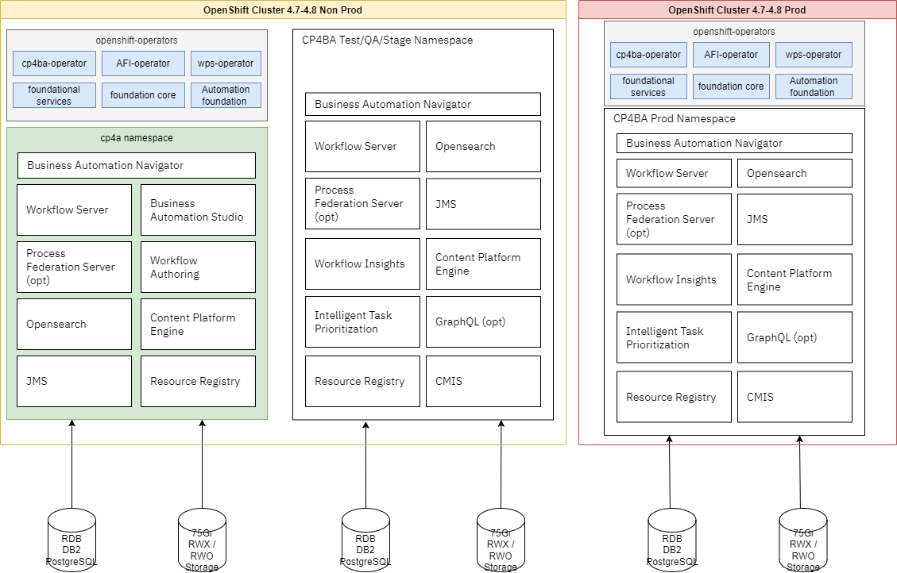

# Business Automation Solution GitOps catalog

Updated: 2022-02-02

[GitOps](https://www.redhat.com/en/topics/devops/what-is-gitops) is a set of practices to manage infrastructure and application configurations using Git.
GitOps works by using Git as a single source of truth for declarative infrastructure and applications.
GitOps uses Git pull requests to manage infrastructure provisioning and deployment automatically.
The Git repository contains the entire state of the system so that the trail of changes to the system state is visible and auditable.

## Overview

This GitOps Catalog includes [kustomize](http://kustomize.io) base and overlays folders for a
number of OpenShift operators needed to deploy IBM Cloud Pak for Business Automation products.
This repository is using the same catalog structure as introduced by Red Hat COP team in [this repository](https://github.com/redhat-cop/gitops-catalog).

This repository define Operator subscriptions for the different IBM Cloud Pak for Business Automation product release starting for 2021.3 or Q4 release.

Cloud Pak for Business Automation has a set of different capabilities that could be presented in the following figure:


(src for this diagram: [docs/diagrams/CP4BA-capabilities.drawio](./docs/diagrams/CP4Automation-capabilities.drawio))

To support those capabilities, different operators may be deployed to an OpenShift cluster:


(src for this diagram: [docs/diagrams/CP4BA_Operators.drawio](./docs/diagrams/CP4BA_Operators.drawio))

This is an example of such operators visible within the OpenShift console


* **IBM® Automation Foundation Core**:

    * RPA-driven automation
    * process mining
    * mongoDB for Identity and Access Management (IAM)
    * metering, OpenID,..  
    * Zen UI.

* **Cloud Pak foundational services**: (bedrock - common services) [Product doc](https://www.ibm.com/docs/en/cpfs). It includes IAM and certificate management.
* **IBM® Automation Insights foundation** operator installs the required dependency operators, such as the IBM Events Operator, the Elasticsearch Operator and the Event Processing Operator.
* **Cloud Pak for Business Automation** includes Business Automation Studio and Business Automation Navigator to provide a unified authoring environment and an entry point to various low-code design tools with a single sign-on (SSO) experience and team management.


Once those operators are installed, the way operands will be added will depend on the
different products (capabilities) to install and if they are shared between developer teams or not.

Read this [important note](https://www.ibm.com/docs/en/cloud-paks/cp-biz-automation/21.0.3?topic=deployment-capabilities-starter-deployments) on the relationship between capabilities and operators.

Depending on the selected capabilities, the needed components of the foundation are installed. The final custom resource file combines capabilities and components from one or more capabilities.


### Common Services

Installing most of those operators will create Foundational service instances like in the following figure:


(src for this diagram: [docs/diagrams/Foundational_Services_on_OCP.drawio](./docs/diagrams/Foundational_Services_on_OCP.drawio))

### Business Automation Workflow (BAW) example

If we want to develop process applications, we will have the Automation Studio deployed in one namespace and then the workflow server and other runtimes in the different environment namespaces (dev, staging):


(src for this diagram: [docs/diagrams/Business_Automation_WorkflowOCP.drawio](./docs/diagrams/Business_Automation_WorkflowOCP.drawio))

This GitOps Catalog defines the operator only. The [infra gitOps repository](https://github.com/ibm-cloud-architecture/dba-infra-gitops) defines
custom resources for runtime and authoring component deployments.

### Automation Decision Services on AWS - ROSA

See the detailed article to deploy Cloud Pak for Business Automation and ADS on AWS Managed Red Hat OpenShift ROSA [here](./docs/CP4BA-ADS-ROSAV.md)

## Reuse diagrams and images

Head to the [docs readme](https://github.com/ibm-cloud-architecture/dba-gitops-catalog/tree/main/docs/README.md) for information on the draw.io diagrams and images that can be used immediately and customized for your needs.

### Example diagram: Business Automation Workflow (BAW) deployment on OpenShift Container Platform (OCP)



## Setting up a cluster

In this section we will present how to bootstrap the operators deployment

### Prerequisites

#### On your laptop

* git client, oc CLI, podman or docker CLIs, with unzip tool
* Get this repository for the scripts and Custom Resources

```sh
git clone https://github.com/ibm-cloud-architecture/dba-gitops-catalog.git
```

#### Red Hat OpenShift  

* Get a running OpenShift v4.7+ cluster with enough resources to deploy cloud pak for automation.
A cluster will all capabilities need 11 nodes (see [system requirements](https://www.ibm.com/docs/en/cloud-paks/cp-biz-automation/21.0.3?topic=ppd-system-requirements)):

   * Master (3 nodes): 4 vCPU and 8 GB memory on each node.
   * Worker (8 nodes): 16 vCPU and 32 GB memory on each node.

* Be sure to have the cluster using Network Time Protocol by setting [a chrony time service](https://www.ibm.com/docs/en/openshift?source=https%3A%2F%2Fdocs.openshift.com%2Fcontainer-platform%2F4.7%2Finstalling%2Finstall_config%2Finstalling-customizing.html%23installation-special-config-chrony_installing-customizing&referrer=SSYHZ8_21.0.x%2Fcom.ibm.dba.install%2Fop_topics%2Ftsk_preparing_demo.html).

For demo purpose, a three nodes cluster should be enough (32 CPUs and 64 GB RAM, for example flavor c3c.32x64 on ROKS). See this [set of questions](https://www.ibm.com/docs/en/cloud-paks/cp-biz-automation/21.0.3?topic=deployments-quick-reference-qa-demo)
to review.

#### Active Directory

For production deployment, you need a LDAP server accessible from the OpenShift cluster. For demonstration purpose, Cloud Pak for Business Automation starter configuration uses OpenLDAP.

#### IBM Entitlement Key

The IBM Entitlement Key is required to pull IBM Cloud Pak specific container images from the IBM Entitled Registry. To get an entitlement key,

* Log in to MyIBM Container Software Library with an IBMid and password associated with the entitled software. See
[https://www.ibm.com/docs/en/cloud-paks/1.0?topic=clusters-obtaining-your-entitlement-key](https://www.ibm.com/docs/en/cloud-paks/1.0?topic=clusters-obtaining-your-entitlement-key)

    1. Select the View library option to verify your entitlement(s).
    1. Select the Get entitlement key to retrieve the key, place it in a file called `./assets/entitlement_key.text`
    1. Enter the email address used to generate the entitlement key in a file called `./assets/ibm_email.text`


## Deploy a solution

Each solution will deploy the different IBM Automation components according to their requirements.

As an example the [dba-infra-gitops](https://github.com/ibm-cloud-architecture/dba-infra-gitops) repository is using scripts,
OpenShift GitOps to deploy Business Automation Workflow (BAW), Business Automation Insights (BAI), and Automation Decision Services (ADS).

## Resources

*Preparing:*

Resources: https://www.ibm.com/docs/en/cloud-paks/cp-biz-automation/21.0.x?topic=deployments-preparing-enterprise-deployment

Cluster: https://www.ibm.com/docs/en/cloud-paks/cp-biz-automation/21.0.x?topic=cluster-setting-up-by-running-script

Capabilities: https://www.ibm.com/docs/en/cloud-paks/cp-biz-automation/21.0.x?topic=capabilities-enterprise-deployments

LDAP: https://www.ibm.com/docs/en/cloud-paks/cp-biz-automation/21.0.x?topic=parameters-ldap-configuration

UMS DB: https://www.ibm.com/docs/en/cloud-paks/cp-biz-automation/21.0.x?topic=database-preparing-postgresql

BAN DB: https://www.ibm.com/docs/en/cloud-paks/cp-biz-automation/21.0.x?topic=navigator-preparing-database

BAS/Playback Server Engine DB: https://www.ibm.com/docs/en/cloud-paks/cp-biz-automation/21.0.x?topic=databases-creating-postgresql-database

Secrets: https://www.ibm.com/docs/en/cloud-paks/cp-biz-automation/21.0.x?topic=authoring-creating-secrets-protect-sensitive-configuration-data

*Configuration:*

UMS: https://www.ibm.com/docs/en/cloud-paks/cp-biz-automation/21.0.x?topic=resource-configuring-user-management-services

BAS: https://www.ibm.com/docs/en/cloud-paks/cp-biz-automation/21.0.x?topic=resource-configuring-business-automation-studio

ADS: https://www.ibm.com/docs/en/cloud-paks/cp-biz-automation/21.0.x?topic=resource-configuring-automation-decision-services

*Parameters*:

UMS: https://www.ibm.com/docs/en/cloud-paks/cp-biz-automation/21.0.x?topic=parameters-ums

BAS: https://www.ibm.com/docs/en/cloud-paks/cp-biz-automation/21.0.x?topic=parameters-business-automation-studio

ADS: https://www.ibm.com/docs/en/cloud-paks/cp-biz-automation/21.0.x?topic=parameters-automation-decision-services

Helm based GitOps for Cloud Pak [https://github.com/IBM/cloudpak-gitops](https://github.com/IBM/cloudpak-gitops)
