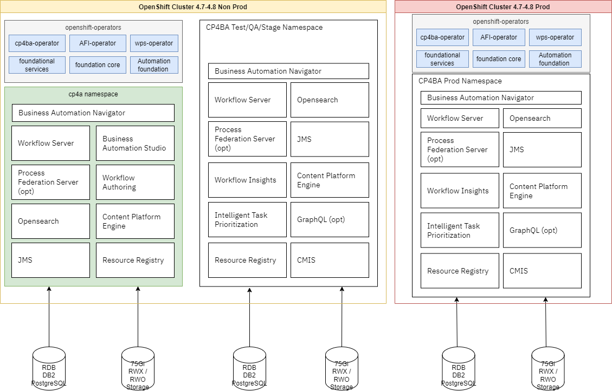
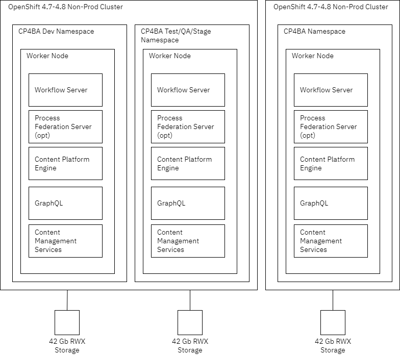
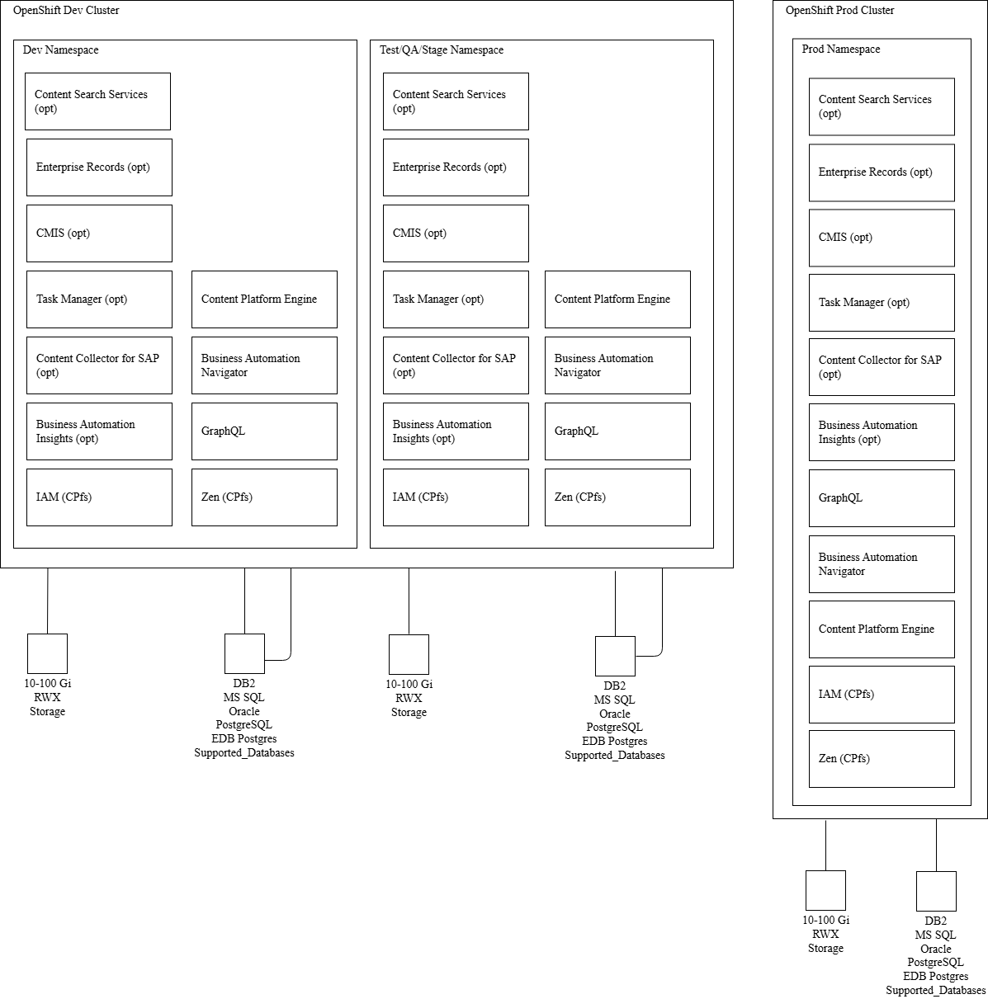
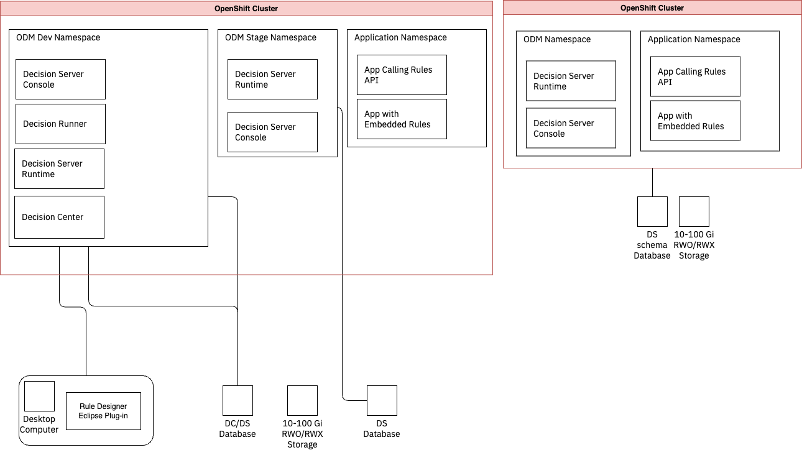
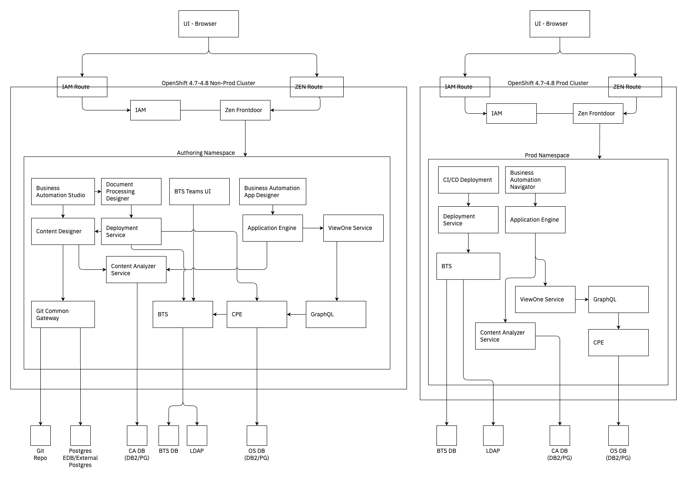

# Business Automation Architecture Diagrams

Updated: 2022-02-17

Within the Cloud Pak for [Business Automation GitOps Catalog](https://github.com/ibm-cloud-architecture/dba-gitops-catalog) are a folder of reusable [diagrams](https://github.com/ibm-cloud-architecture/dba-gitops-catalog/tree/main/docs/diagrams) that can be used as-is or customized to present reference architectures and deployments.  Additionally, get you started quickly with examples, a folder of [images](https://github.com/ibm-cloud-architecture/dba-gitops-catalog/tree/main/docs/images) produced from those diagrams so you can see how powerful these diagram can be for your architecture efforts.

What's should you do next?
  1. To be able to update those diagrams you will need to install [draw.io on your host](https://github.com/jgraph/drawio-desktop/releases) or use [VScode](https://code.visualstudio.com/) with the drawio extension.
  1. You will need the IBM stencils found in [this website](https://github.com/ibm-cloud-architecture/ibm-cloud-stencils/releases).
  1. Head to the [main repo](https://github.com/ibm-cloud-architecture/dba-gitops-catalog) and click the green **Code** button to download/clone the repo and customize your own diagrams, mixing and matching to meet your needs or the needs of your client.

## Here are some examples from the images folder

### Golden topology for OpenShift

### OpenShift High Availability deployment

### Disaster recovery with Persistence Volume duplication

### Disaster recovery with passive data center

### Business Automation Workflow deployment on OCP

### Automation Workstream deployment on OCP

### Business Automation Application deployment on OCP

### Content management deployment

### Automation decision service deployment

### Operational Decision Manager deployment on OpenShift

### Automation document processing deployment

### Process mining deployment on OpenShift

### Robotic Process Automation deployment on OpenShift

### Robotic Process Automation deployment on Windows

